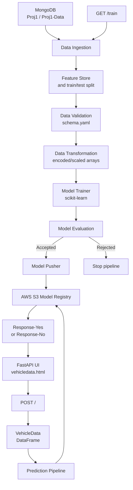
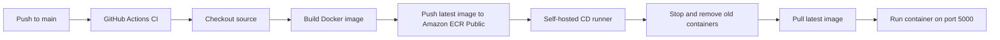
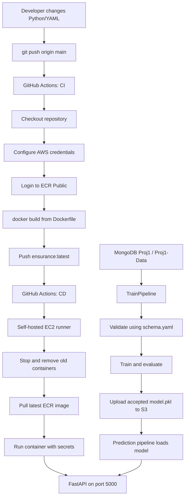

# Vehicle Insurance MLOps

A production-oriented machine learning project for predicting whether a customer is likely to respond to a vehicle insurance offer. The project combines a MongoDB-backed training pipeline, data validation and transformation, model evaluation, AWS S3 model storage, and a FastAPI web application for predictions.

## What It Does

- Ingests vehicle insurance data from MongoDB.
- Validates the input data against `config/schema.yaml`.
- Splits and transforms the data for model training.
- Trains a scikit-learn model and evaluates its accuracy.
- Pushes an accepted model to an AWS S3 model registry.
- Serves a browser form through FastAPI for vehicle insurance predictions.

## Architecture



## Project Flow

### Training

1. `GET /train` or `demo.py` starts `TrainPipeline`.
2. Data ingestion reads from MongoDB and creates a timestamped directory under `artifact/`.
3. Data validation writes `report.yaml` and checks the schema.
4. Data transformation creates NumPy datasets and stores the preprocessing object.
5. Model training creates `model.pkl`.
6. Model evaluation compares the model with the configured acceptance threshold.
7. Accepted models are pushed to the configured S3 bucket. Rejected models stop before publishing.

### Prediction

1. Open the web form at `/`.
2. Submit the vehicle details.
3. FastAPI converts the form values into a one-row pandas DataFrame.
4. The prediction pipeline loads the model from the configured S3 location.
5. The UI displays `Response-Yes` or `Response-No`.

## Requirements

- Python 3.10 or newer
- MongoDB database containing the `Proj1-Data` collection
- AWS credentials with access to the configured S3 model bucket
- Git, if cloning the repository

## New Team Member Quick Start

Follow these steps in order. Replace values inside `<angle brackets>` with your own project or AWS values. Never copy another person's passwords, access keys, or connection strings.

### Step 1: Clone the repository

```bash
git clone <repository-url>
cd mlops-p1
git checkout main
```

Confirm that the project root contains `app.py`, `demo.py`, `Dockerfile`, `requirements.txt`, `config/`, and `src/` before continuing.

### Step 2: Create the Python environment

**Windows PowerShell:**

```powershell
py -3.10 -m venv .venv
.\.venv\Scripts\Activate.ps1
python -m pip install --upgrade pip
pip install -r requirements.txt
```

**Linux or macOS:**

```bash
python3.10 -m venv .venv
source .venv/bin/activate
python -m pip install --upgrade pip
pip install -r requirements.txt
```

Expected checkpoint: `python --version` prints Python 3.10 or newer and the dependency installation finishes without errors.

### Step 3: Add local environment variables

Create a file named `.env` in the project root, or set the variables in the current terminal:

```dotenv
MONGODB_URL=mongodb+srv://<username>:<password>@<cluster>/?appName=<app>
AWS_ACCESS_KEY_ID=<your-access-key-id>
AWS_SECRET_ACCESS_KEY=<your-secret-access-key>
AWS_DEFAULT_REGION=us-east-1
```

The current Python code reads environment variables. If your shell does not automatically load `.env`, export the values before running the application.

**Windows PowerShell:**

```powershell
$env:MONGODB_URL = "mongodb+srv://<username>:<password>@<cluster>/?appName=<app>"
$env:AWS_ACCESS_KEY_ID = "<your-access-key-id>"
$env:AWS_SECRET_ACCESS_KEY = "<your-secret-access-key>"
$env:AWS_DEFAULT_REGION = "us-east-1"
```

Expected checkpoint: the variables exist in the current terminal, but their values are not printed or committed.

### Step 4: Confirm MongoDB data

In MongoDB, confirm that database `Proj1` contains collection `Proj1-Data`. The collection needs the fields described in `config/schema.yaml`, especially `Response`, because that is the training target.

Expected checkpoint: the MongoDB user can read the collection from the machine where training will run.

### Step 5: Confirm AWS model storage

In AWS S3, confirm that the bucket name in `MODEL_BUCKET_NAME` in `src/constants/__init__.py` exists in `us-east-1`. The AWS identity needs permission to list the bucket and read or write `model.pkl`.

Expected checkpoint: the identity can access the bucket without an `AccessDenied` error. Do not make the bucket public; the application uses credentials to load the model.

### Step 6: Train the first model

With the virtual environment active and environment variables set, run:

```bash
python demo.py
```

Expected results:

1. A new directory appears under `artifact/<timestamp>/`.
2. Data ingestion creates feature-store and train/test files.
3. Validation creates `data_validation/report.yaml`.
4. Transformation creates NumPy data and a preprocessing object.
5. Training creates a local `model.pkl`.
6. Evaluation either accepts or rejects the model.
7. An accepted model is uploaded to S3 as `model.pkl`.

If the model is rejected, inspect the terminal output and `logs/`; no new production model is uploaded.

### Step 7: Run the web application

```bash
python app.py
```

Open `http://localhost:5000`, enter the vehicle fields, and select **Predict**. The page should show `Response-Yes` or `Response-No`. Select **Train Model** only when you intentionally want to run training through the `/train` route.

### Step 8: Test the container

```bash
docker build -t vehicle-insurance-mlops:local .
docker run --rm -p 5000:5000 --env-file .env vehicle-insurance-mlops:local
```

Open `http://localhost:5000` again. Stop the container with `Ctrl+C` if it is running in the foreground.

### Step 9: Make a team change

Use a feature branch, test locally, and push the branch for review:

```bash
git checkout -b feature/<short-description>
git add .
git commit -m "Describe the change"
git push -u origin feature/<short-description>
```

After review, merge the change into `main`. A push to `main` starts the GitHub Actions deployment described below.

### Step 10: Verify deployment

After the GitHub Actions workflow finishes successfully, open:

```text
http://<ec2-public-ip>:5000
```

Check the Actions run, the EC2 Docker container, and the application response. If the page is unavailable, check the [Troubleshooting](#troubleshooting) section before changing credentials or infrastructure.

## Installation

### Windows PowerShell

```powershell
python -m venv .venv
.\.venv\Scripts\Activate.ps1
python -m pip install --upgrade pip
pip install -r requirements.txt
```

### Linux or macOS

```bash
python3 -m venv .venv
source .venv/bin/activate
python -m pip install --upgrade pip
pip install -r requirements.txt
```

## Environment Variables

Create a local `.env` file or export these variables in the shell. Do not commit credentials to Git.

```dotenv
MONGODB_URL=mongodb+srv://<username>:<password>@<cluster>/?appName=<app>
AWS_ACCESS_KEY_ID=<your-access-key-id>
AWS_SECRET_ACCESS_KEY=<your-secret-access-key>
```

The application uses the `MONGODB_URL` variable and connects to:

- Database: `Proj1`
- Collection: `Proj1-Data`

The model registry is configured in `src/constants/__init__.py` and currently targets the S3 bucket configured by `MODEL_BUCKET_NAME`.

## Running the Application

Start the FastAPI server:

```bash
python app.py
```

Then open [http://localhost:5000](http://localhost:5000).

Available routes:

| Method | Route | Description |
| --- | --- | --- |
| `GET` | `/` | Renders the vehicle prediction form |
| `POST` | `/` | Predicts the insurance response from submitted form data |
| `GET` | `/train` | Runs the complete training pipeline |

The interactive API documentation is available at [http://localhost:5000/docs](http://localhost:5000/docs).

## Running Training Directly

To run training without starting the web server:

```bash
python demo.py
```

Each run creates a new timestamped artifact directory similar to:

```text
artifact/<timestamp>/
├── data_ingestion/
├── data_validation/
├── data_transformation/
└── model_trainer/
```

## Docker

Build and run the application:

```bash
docker build -t vehicle-insurance-mlops .
docker run --rm -p 5000:5000 --env-file .env vehicle-insurance-mlops
```

The container starts `app.py` and listens on port `5000`.

## Complete Python-to-AWS Setup

Use the following order when setting up the project on a new machine or AWS account.

### 1. Prepare the Python environment

Install Python 3.10, create a virtual environment, activate it, and install the dependencies as described in [Installation](#installation). The `-e .` entry in `requirements.txt` installs this repository as a local package, so run commands from the project root.

### 2. Prepare MongoDB

Create or select a MongoDB deployment, allow the application host's IP address, and create:

- Database: `Proj1`
- Collection: `Proj1-Data`

The collection must contain the fields described in `config/schema.yaml`, including the target column `Response`. Put the MongoDB connection string in `MONGODB_URL` and verify access before training:

```powershell
$env:MONGODB_URL = "mongodb+srv://<username>:<password>@<cluster>/?appName=<app>"
python demo.py
```

### 3. Prepare AWS S3 for the model registry

Create an S3 bucket in `us-east-1`, or update `MODEL_BUCKET_NAME` in `src/constants/__init__.py` to an existing bucket. The training pipeline stores the accepted serialized model at the S3 key `model.pkl`. Prediction loads that same key from S3.

Create an IAM user or role with only the permissions required by the application. At minimum, the training and prediction identity needs access to the model object:

```json
{
    "Version": "2012-10-17",
    "Statement": [
        {
            "Effect": "Allow",
            "Action": ["s3:GetObject", "s3:PutObject", "s3:ListBucket"],
            "Resource": [
                "arn:aws:s3:::<model-bucket>",
                "arn:aws:s3:::<model-bucket>/*"
            ]
        }
    ]
}
```

For local execution, export `AWS_ACCESS_KEY_ID` and `AWS_SECRET_ACCESS_KEY`. For an EC2 deployment, prefer an instance role instead of long-lived access keys; the current code expects the two environment variables, so update `src/configuration/aws_connection.py` before relying on instance-role credentials.

### 4. Run and verify training locally

Set the MongoDB and AWS variables, then run:

```powershell
python demo.py
```

The run creates `artifact/<timestamp>/` and executes ingestion, validation, transformation, training, evaluation, and model pushing. Check the logs and confirm that `model.pkl` exists in the configured S3 bucket. Only an accepted model is uploaded.

### 5. Verify the FastAPI application locally

Start the application:

```powershell
python app.py
```

Open `http://localhost:5000`, submit the form, and confirm that the response is `Response-Yes` or `Response-No`. This step requires `model.pkl` to already be available in S3.

### 6. Build and test the production image

Build the same image used by CI and test it locally:

```bash
docker build -t vehicle-insurance-mlops:local .
docker run --rm -p 5000:5000 --env-file .env vehicle-insurance-mlops:local
```

The image copies the whole repository into `/app`, installs `requirements.txt`, exposes port `5000`, and starts `python3 app.py`.

### 7. Prepare Amazon ECR Public

The current workflow publishes to this ECR Public image:

```text
public.ecr.aws/r5n8c5l0/ensurance:latest
```

Make sure the AWS identity used by GitHub Actions can authenticate to ECR Public and push images. If you use a different registry or repository, change `ECR_REGISTRY`, `ECR_REPOSITORY`, and the image reference in `.github/workflows/aws.yaml`.

### 8. Prepare the EC2 deployment runner

Launch an EC2 instance with Docker installed and configure it as a GitHub self-hosted runner. The runner must:

1. Be online and assigned the labels expected by the workflow.
2. Have outbound access to GitHub, ECR Public, MongoDB, and S3.
3. Allow inbound TCP port `5000` in its security group if the application is accessed directly.
4. Have permission to run Docker without interactive `sudo` prompts.

The workflow does not create the EC2 instance or install Docker. Those are one-time infrastructure steps that must be completed before the CD job can run.

### 9. Configure GitHub secrets

In the repository, open **Settings > Secrets and variables > Actions** and add:

| Secret | Required by | Value |
| --- | --- | --- |
| `AWS_ACCESS_KEY_ID` | CI, CD, and application | IAM access key ID |
| `AWS_SECRET_ACCESS_KEY` | CI, CD, and application | IAM secret access key |
| `AWS_DEFAULT_REGION` | Deployed container | `us-east-1` |
| `MONGODB_URL` | Deployed container | MongoDB connection string |

Never commit `.env`, MongoDB URLs, or AWS keys. Rotate any credential that has been exposed in shell history, logs, screenshots, or Git history.

### 10. Deploy by pushing to `main`

```bash
git add .
git commit -m "Deploy application"
git push origin main
```

The workflow then builds and publishes the image, waits for CI to finish, and replaces the container on the self-hosted runner. Monitor the run under the repository's **Actions** tab, then open `http://<ec2-public-ip>:5000` after deployment.

## CI/CD Pipeline

The workflow in `.github/workflows/aws.yaml` runs automatically on every push to the `main` branch.



### Continuous Integration

The CI job runs on `ubuntu-latest` and:

1. Checks out the repository.
2. Configures AWS credentials.
3. Logs in to Amazon ECR Public.
4. Builds the image from `Dockerfile`.
5. Pushes `public.ecr.aws/r5n8c5l0/ensurance:latest`.

### Continuous Deployment

After CI succeeds, the CD job runs on a self-hosted GitHub Actions runner. It stops and removes existing Docker containers, pulls the latest image, and starts the application on port `5000`.

Configure these repository or organization secrets before enabling deployment:

| Secret | Used for |
| --- | --- |
| `AWS_ACCESS_KEY_ID` | AWS authentication and container runtime access |
| `AWS_SECRET_ACCESS_KEY` | AWS authentication and container runtime access |
| `AWS_DEFAULT_REGION` | AWS region passed to the deployed container |
| `MONGODB_URL` | MongoDB connection used by the application |

The self-hosted runner must have Docker installed, be online, and be able to bind host port `5000`. The deployment workflow currently uses the `latest` image tag and replaces running containers on each successful deployment.

## YAML Configuration Guide

This repository contains three YAML files. They serve different purposes:

### `config/schema.yaml`

This is the data contract used during validation and transformation. It defines:

- Expected columns and their logical types.
- Numerical and categorical feature lists.
- The target column, `Response`.
- Transformation inputs such as `num_features` and `mm_columns`.
- The configured `drop_columns` value.

When the MongoDB dataset changes, update this file together with the ingestion and transformation code, then run training locally before deploying.

### `config/model.yaml`

This file currently exists but is empty. The active model settings are currently defined as constants in `src/constants/__init__.py` and exposed through `src/entity/config_entity.py`, including the expected score, estimator count, split settings, depth, criterion, and random state. Add model parameters to `config/model.yaml` only after updating the trainer to read them.

### `.github/workflows/aws.yaml`

This is the GitHub Actions deployment definition. Its important settings are:

- Trigger: pushes to `main`.
- CI runner: `ubuntu-latest`.
- CD runner: a `self-hosted` runner, intended to be the EC2 host.
- AWS region: `us-east-1`.
- Image: `public.ecr.aws/r5n8c5l0/ensurance:latest`.
- Application port: `5000`.

The workflow currently has no automated unit-test, lint, schema-test, or health-check step. Add those checks before the Docker build for a stronger CI gate. It also uses the mutable `latest` tag, so use an immutable Git SHA tag for production rollback capability.

## End-to-End Deployment Diagram



## Configuration

- `config/schema.yaml`: expected columns, types, categorical fields, numerical fields, and transformation settings.
- `src/constants/__init__.py`: artifact paths, MongoDB names, model thresholds, S3 settings, host, and port.
- `src/entity/config_entity.py`: timestamped training and prediction configuration.
- `templates/vehicledata.html`: prediction form and displayed result.
- `static/css/style.css`: web interface styling.

## Repository Layout

```text
.
├── app.py                         # FastAPI application
├── demo.py                        # Direct training entry point
├── Dockerfile                     # Container image definition
├── .github/workflows/aws.yaml     # CI/CD build and deployment workflow
├── config/                        # Schema and model configuration
├── artifact/                      # Generated training outputs
├── templates/                     # Jinja2 HTML templates
├── static/                        # CSS and static assets
└── src/
    ├── components/                # Ingestion, validation, transformation, training, evaluation, pushing
    ├── configuration/             # MongoDB and AWS connection helpers
    ├── data_access/               # MongoDB data access
    ├── entity/                    # Configuration, artifacts, and estimators
    └── pipline/                   # Training and prediction orchestration
```

## Notes

- Training requires network access to MongoDB and AWS S3.
- Prediction requires a model to already exist in the configured S3 registry.
- Generated artifacts and local secrets should remain outside version control.

## Troubleshooting

| Problem | Check |
| --- | --- |
| `MONGODB_URL` is not set | Activate the correct terminal environment and export `MONGODB_URL` again. A `.env` file is not automatically loaded by the current application code. |
| MongoDB connection fails | Check the connection string, database user, password encoding, and MongoDB Network Access allowlist. |
| S3 returns `AccessDenied` | Confirm the AWS keys, region, bucket name, and `s3:GetObject`, `s3:PutObject`, and `s3:ListBucket` permissions. |
| Prediction cannot find `model.pkl` | Run `python demo.py`, confirm the model was accepted, and verify that `model.pkl` exists in the configured S3 bucket. |
| Port `5000` is already in use | Stop the existing process or container, then start the application again. On Windows, use `Get-NetTCPConnection -LocalPort 5000`. |
| GitHub CD job is queued | Confirm that the self-hosted EC2 runner is online, has Docker installed, and is available to the repository. |
| EC2 application is unreachable | Check the EC2 security group allows inbound TCP `5000`, the container is running, and the host has pulled the latest ECR image. |
| Docker build fails | Confirm Docker is running and rerun `pip install -r requirements.txt` locally to identify dependency problems before rebuilding. |
